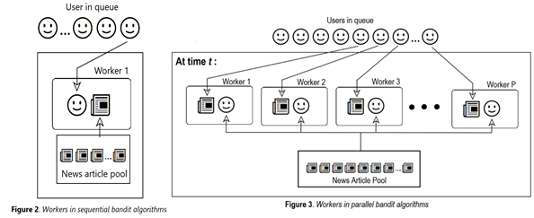

## Abstract
Impacts on performance of bandit algorithms in recommending news article when adapted for recommending to multiple users
in parallel is studied in this work. The algorithms explored in this work are sequential LinUCB, sequential Thompson 
Sampling, parallelized Lazy LinUCB, parallelized Lazy Thompson Sampling, parallelized non-Lazy LinUCB, parallelized 
non-Lazy Thompson Sampling. The algorithms belong to a class of contextual bandit algorithms which in turn is a subclass
of multiarmed bandit algorithms. Aim in this work is to explore whether parallelized implementation for faster 
performance at the expected sacrifice of rewards is worth using in a practical scenario – the scenario being news 
article recommendation to users. The dataset used for experimentation is Yahoo! Front Page Today Module dataset R6A.

## Research Content
### 1. Introduction
The algorithms implemented in this work are a class of contextual bandit algorithms which in turn are a subclass of 
multiarmed bandit problems. A multiarmed bandit problem refers to a scenario where a hypothetical agent has access to a 
limited set of choices, where each of the choices yield a reward unknown to the agent. The only way for the agent to get
an estimate of the underlying reward distribution is to first try out a few choices and to observe the reward obtained 
for the corresponding choices. Different bandit algorithms offer different theoretical basis on which to estimate the
long-term expected reward of each of the choices or arms based on the reward/trial history. The agent then uses the 
current estimate to choose arms to maximize the long-term reward gain from limited tryouts/trials at hand. In case of 
contextual bandit problems, the reward varies depending not just on the choices themselves but also on the situation 
under which the choices were made.
In the analogy of news article recommendation, the news articles are the “arms” a and the reward at time t 
(denoted as rt) would be “1” if the reader(user) to whom it was recommended clicks the recommended article or 
“0” if the user does not click on the article. The situation or “context” in this scenario is denoted by a vector, 
denoted as xt,a, which is derived from information about users(user features) to whom the article Is being 
recommended, and from information about the news(arm features). The derivation is illustrated in **Fig1**

In the algorithms to be discussed here, The expected reward function for all the algorithms given the context vector is
assumed to be linear. This is expressed as:

In this work, the algorithms explored are sequential LinUCB[1], parallel Lazy LinUCB[3], parallel 
Non-Lazy LinUCB[3], sequential Thompson Sampling[2], Lazy Thompson Sampling[3] and 
Non-Lazy Thompson sampling[3]. To help with visualization of multitude of users being recommended articles by
the algorithm and the limit in spread of information with which the recommendation decisions are made, the concept of a 
news article “server” or a “worker” is introduced. In sequential versions of LinUCB[1] and Thompson 
Sampling[2], one user is served at a particular time step. In parallel versions of the algorithms, 
which are modified from [3], there are P workers serving news articles in parallel, attending to batches of 
P users from queue at a particular time step. This distinction is illustrated in 
**figure 2** and **figure 3**.

The following discussion are about steps in algorithm elaborated in “Research Methods” Section.
Sequential LinUCB calculates the vector bt by the following iterative update :

And then at time t+1, &theta;t+1 &rarr; V-1t+1 bt is used to estimate max 
expected reward for each arm as :

where &alpha; is a hyperparameter that encourages higher selection frequency for underexplored arms. The arm/article 
with the highest reward estimate is then chosen to be recommended.

In case of Thompson Sampling algorithm, all parameter updates are the same except at the two following points.
The following update remains the same in both Thompson sampling and LinUCB: 

the estimate above is then used as a mean for the following normal distrubution: 

The distribution above is then sampled from to get an estimate for \theta to be then used to compute ,before a 
particular arm is selected, maximum reward estimate for each arm given by the expression below: 

Upon observing the rewards and updating all the relevant parameters , the worker receives the next user
in queue for the next iteration
The sequential algorithms keep a pseudocount of features encountered in previous time steps using a covariance matrix
Vt, whose value at time t is computed as: 

or iteratively as: 

The sole worker in sequential algorithms uses the entire 
history of encountered context vectors through the covariance matrix and also the pseudocount of rewards for
corresponding vectors via a parameter 
bt (computed as bt &rarr; bt-1+xt,atrt )
when choosing a news article for a particular user.
The parallelized version of covariance matrix  Vt,p for Lazy and Non-Lazy algorithm for both Thompson 
sampling and 
LinUCB are to be used for calculation of estimate of &theta;t at time step t are calculated as follows:
For Lazy, at time t, the cumulative value of covariance, iteratively calculated for each p in order, from the start of 
the experiment stands at:

For Non-Lazy at time t, each of the p workers use the same covariance matrix, the cumulative value of covariance from 
the start of the experiment stands at:

In covariance matrix for Lazy the additional term of sum outer product of context vector for corresponding selected arm
by preceding workers leads to more variable selection of arms within the batch, more specifically, this additional 
summation induces higher selection of articles which were underexplored given the context. This selection of more 
suboptimal articles(articles which do not have highest expected reward given the context at that particular time step)
earlier in the experiment leads to higher reward in the long term as articles with better expected reward, given the 
context could be discovered. 

In Non-Lazy Parallel algorithms, at time step t, the entire batch of P workers use the covariance matrix and the pseudo 
reward count updated at the end of previous time steps, meaning the workers are unaware of the encountered context 
vector information(via covariance matrix), arm selection and corresponding reward for preceding workers in the same 
batch. 

This “unawareness” leading to reduced number of computations within the same batch increases serving speed, but the 
reward is expected to be less because of less information being used during decision making.
In Lazy Parallel algorithms, the workers in the same batch are aware of the pseudocount of context features encountered
from t=1 up to preceding workers in the same batch via the covariance matrix Vt,p but are unaware of the 
corresponding pseudo feature-reward count that comes with the parameter bt. The relative higher extent of 
information 
accessibility of preceding workers within the batch leads one to expect higher reward in Lazy compared to Non-Lazy and 
hence slower speed due to increased computation involved within a batch. 

The specific method of how covariance matrix is used in each of the algorithms to make decision is shown in the sections 
that follow.

### 2. Research Purpose
Purpose of this research has been to find out the extent to which parallelized modification of contextual bandit
algorithms impact the rewards obtained from recommending news articles to users. The reason parallelized implementation
of contextual bandit algorithms is desirable, despite the hypothesized superiority of sequential algorithms in terms of
reward gain, is because of the speed gain and the ability to serve a multitude of users at a single time step. While 
in-depth analysis of the steps in each of the algorithms reveal the impact on reward and speed to be expected, the
extent to which the expectations might hold in a practical scenario is investigated using a real-world news article 
recommendation dataset .
###3. Research Methods
#### Experiment Procedure
Dataset used: R6A - Yahoo! Front Page Today Module User Click Log Dataset, version 1.0
Processor Used: Intel Core i7-10700KF 5.1 GHz
Dataset contents:

    6 user features, 6 Article features, ID of the article being displayed to the user
    observed reward for the article shown, pool of article ID's at time t from which article to be displayed is chosen.

Hyperparameters and parameters are first initialized. At each iteration, user features and article features are used to 
form the context vector. If the selected article in experiment matches the selected arm in mentioned in the dataset, 
the rewards for that context is observed.

Taking into account the original papers [1],[2],[3] where the algorithms were first published, the following modified 
approach to implementing the algorithms were taken:

While standalone algorithms for sequential algorithms exist, and were at the initial phase of the project, implemented
as such, the sequential algorithms turn out to be a special case of the parallelized algorithms when the number of 
workers, p, is set as 1. So, the results for sequential algorithms presented here were obtained by setting p = 1 for 
parallelized algorithms, similar to how it’s illustrated in [3]
For efficient computation of inverse of covariance matrix, the following derivation, using the work of Kennet S 
Miller[4], was used:

This computation allows us to avoid an expensive inverse calculation after every 
update of covariance matrix. Instead the inverse calculated in previous time step could be used with the outer product 
of context vectors to find the inverse of updated 
matrix. 

### 4. Research Results

While plenty of graphs were generated throughout the duration of project to help lead the research. Few of the results, 
after reaching the final refined stages of the project have been presented below:

 

In **figure 4** to **6** above, the plots show curves flattening around constant values of CTR from last third of the 
experiment. This convergence is indicative of the algorithms learning the true reward of the news articles. The initial 
dip is indicative of the algorithms choosing suboptimal arms in order to learn more about expected reward of news 
articles in pool given the particular user features. 
#### Non Lazy Parallel vs Sequential algorithms
Since covariance matrix is not updated within the batch a particular time step t, the expectation is that Non-Lazy
Parallel will suffer loss in reward compared to their sequential counterpart. The convergence points in **Figure 4** and
**Figure 5** confirm this, however the span of difference in rewards is smaller than 0.01 in CTR. However, the average 
number of users served per second is 3.48 times higher for Non-Lazy Parallel in LinUCB and around 2.00 times higher 
in Non-Lazy Parallel Thompson Sampling as illustrated in **Figure 8**. 

#### Lazy Parallel vs Non-Lazy Parallel algorithms

The covariance calculation formula above, for Lazy algorithms differ from the Non-lazy in that the latter’s covariance
formula does include the last summation term. Therefore, when experiment has progressed long enough so that T*P >> P, 
the difference in the value of covariance matrix in both algorithms become negligible and hence under scenarios that 
involve running the experiment for scenarios where T>>P, theoretical implications would support the notion of 
sacrificing reward via use of non-Lazy algorithms over Lazy ones to exploit the significantly higher runtime speed. In 
situations where this scenario does not arise, for covariance related issues discussed before, the resulting less 
information access of Non-Lazy algorithm is expected lead to loss in rewards. 

As expected, the there is loss in reward for Non-Lazy algorithms, though still the span of difference of converged CTR
value is less than 0.01. as can be seen in **Figure 6** and **Figure 7**. The speed, as shown in **Figure 9**,for Lazy 
LinUCB 
algorithm is 1.89 times faster and Lazy-Thompson Sampling is around 1.68 times faster. This is due to the increased 
frequency of covariance computation required within a batch.

### 5.	Research Achievements
- With the aid of published research work, successful implementation of parallelized modification of the sequential 
  algorithms and following successful tested on a real-world news article recommendation dataset that confirms 
  hypothesis implied by the algorithm steps.
- A new hybrid algorithm currently being studied by the team, which has been possible because of the successful 
  implementations in this work.  
### 6.	Expected Contribution / Future Plans
Parallelization evidently leads to a significant gain in speed at the expense of small loss in reward. However, 
the ability for a recommendation service to host a vast number of users in a short time is in the interest of service 
providers, therefore, the small loss in reward is worth sacrificing when a vast number of users require to be served. 

This work is expected to give readers some intuition regarding the extent of speed gain that parallelization can offer 
at the expense of small decrease in reward. The specific steps within the algorithm that lead to such behavior has been 
pointed out and discussed and their extent of impact demonstrated using a real-world dataset. Another issue that arises 
when deploying the algorithms in a practical scenario is deciding which algorithm to use? The future plan of study, 
which we are working on as we speak, seeks to solve that problem using a hybrid algorithm that aim to learn which 
versions of algorithms at hand might be suitable given a particular user context.

### 7. References
- Chu, Wei, et al. "Contextual bandits with linear payoff functions." Proceedings of the Fourteenth International 
  Conference on Artificial Intelligence and Statistics. JMLR Workshop and Conference Proceedings, 2011.
- Agrawal, Shipra, and Navin Goyal. "Thompson sampling for contextual bandits with linear payoffs." International 
  Conference on Machine Learning. PMLR, 2013.
- Chan, Jeffrey, et al. "Parallelizing Contextual Linear Bandits." arXiv preprint arXiv:2105.10590 (2021).
- Miller, Kenneth S. “On the Inverse of the Sum of Matrices.” Mathematics Magazine, vol. 54, no. 2, Mathematical
  Association of America, 1981, pp. 67–72, https://doi.org/10.2307/2690437.
